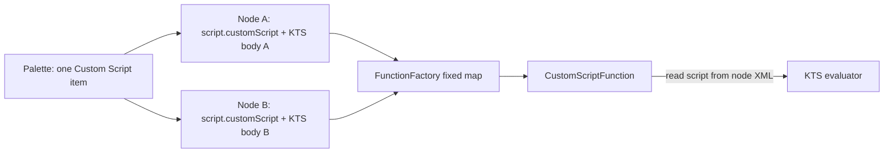

# RFC-1: Custom Script Functions

| Field | Value |
|-------|-------|
| **Status** | Draft |
| **Created** | 2026-07-04 |
| **Scope** | OpenBimRL-Engine, OpenBimRL-Engine-REST, OpenBimRL-CreatorTool |

## Summary

Add Dynamo-style custom nodes via a **single registered engine function** (`script.customScript`) that executes **embedded per-node script source**. The recommended v1 backend is **Kotlin Script (KTS)** for zero translation layer and shared JVM types. Python remains optional later with an explicit JSON marshalling layer.

---

## Motivation

OpenBimRL functions today are compile-time `@OpenBIMRLFunction` classes discovered by `FunctionFactory` at startup. Extending the engine requires rebuilding the JAR and redeploying. Revit Dynamo and similar tools allow practitioners to author custom nodes in script (historically Python).

Goals for custom script support:

- One palette node type; different code per graph instance
- Rich geometry/math on data passed through the graph
- **No direct IFC/native access** from scripts — IFC data flows through existing `ifc.*` nodes upstream
- Minimal changes to `FunctionFactory` and function registration

---

## Core design: one function, many embedded scripts

**One registered function, many embedded scripts** — analogous to [`TextInput`](../src/main/jvm/de/rub/bi/inf/openbimrl/functions/input/TextInput.java), which holds its value on the node rather than on the classpath:

- Register exactly **one** class: `script.customScript`
- Every custom node in the graph uses `function="script.customScript"`
- **Per-node data** carries: script source, language (v1: `kotlin`), user-defined input/output ports
- **`FunctionFactory` stays unchanged** — no dynamic registry, no hacked `getFunction` lookup



This matches Dynamo: one script node type, different code per instance.

---

## Alternatives considered

### Dynamic script registry (`script.myHeatmap`, …)

Register many script keys in `FunctionFactory` at startup or per check. Rejected: requires extending `getFunction` lookup and REST catalog churn. The single `customScript` function avoids hacking the provider model.

### Python via subprocess (CPython)

**Requires a translation layer.** Kotlin/JVM objects cannot cross a process boundary natively:

| Direction | Work |
|-----------|------|
| Engine → Python | Serialize inputs to JSON: `Point3d` → `{x,y,z}`, collections → arrays |
| Python → Engine | Deserialize JSON back to JVM types; validate shapes |
| Rich types | Ship `openbimrl` Python helpers (`Point`, `Matrix`, …) |
| Failure modes | Type mismatches at runtime, not compile time |

Non-trivial and duplicates types already in the engine (`javax.vecmath`, [`Geometry.kt`](../src/main/jvm/de/rub/bi/inf/openbimrl/utils/math/Geometry.kt)).

Deferred as optional Phase 5; same `script.customScript` node with `language="python"` in XML.

### Jython / JPython

Python 2.7 only, unmaintained. Not recommended.

### GraalVM polyglot (in-process Python)

| Issue | Detail |
|-------|--------|
| JDK swap | Polyglot Python needs GraalVM JDK, not current OpenJDK/devcontainer setup |
| Deploy footprint | Larger runtime, more RAM; Spring Boot tuning |
| Graal Python ≠ CPython | `graalpy` lacks full numpy/scipy — weak for Dynamo-style matrix math |
| Ops complexity | Nix/Docker/CI must pin GraalVM |
| Sandbox | In-process; policy easy to misconfigure |

GraalVM removes the Python translation layer in-process but trades deploy cost and ecosystem gaps. **KTS in-process** is simpler today; **CPython subprocess** is simpler than GraalVM if real Python/numpy is required later.

### KTS / KtsRunner (recommended v1)

| Aspect | KTS (in-process) | Python (subprocess) |
|--------|------------------|---------------------|
| Translation layer | **None** — bind `inputs[0]` as `Collection<Point3d>` directly | **Required** |
| Type safety | Compile-time script errors | Runtime only |
| IFC/native isolation | Classpath whitelist — omit `IfcPointer`, JNA | Process boundary |
| Dynamo familiarity | Lower (Kotlin) | Higher (Python) |
| Dependencies | Kotlin 2.3.10 already on classpath | `python3`, optional numpy on server |
| Performance | No IPC | Spawn + JSON per node |

Use **`kotlin-scripting-jvm-host`** (`BasicJvmScriptingHost`) aligned with Kotlin 2.x rather than legacy JSR 223 KtsRunner. Evaluate script text from node XML at check time; cache compilation by script hash.

---

## Type restrictions (KTS)

Treated as a **feature**, not a limitation:

1. **Input bindings are typed** — e.g. `val points: Collection<Point3d> = inputs[0]`. Mismatches fail at script compile.
2. **Classpath whitelist** — `ScriptCompilationConfiguration` exposes only allowed packages. No `IfcPointer`, no `FunctionsLibrary`.
3. **Dynamic ports** — unlike `@FunctionInput` on normal functions, port count/names come from **node XML** (Creator Tool). `CustomScriptFunction` reads ports from the node and builds bindings manually (same idea as `TextInput` reading its value from XML).
4. **Outputs** — script assigns to `outputs: MutableMap<Int, Any?>` or returns `Map<Int, Any?>`; engine validates before `setResult`.

Example embedded script:

```kotlin
// bindings: inputs (List<Any?>), outputs (MutableMap<Int, Any?>)
val points = inputs[0] as Collection<Point3d>
outputs[0] = points.map { Point3d(it.x, it.y + 1.0, it.z) }
```

---

## Target implementation

### 1. Engine: `CustomScriptFunction`

New package: `de.rub.bi.inf.openbimrl.functions.script`

```kotlin
@OpenBIMRLFunction(
    packageName = "script",
    name = "customScript",
    description = "Runs embedded Kotlin script with user-defined inputs/outputs.",
    type = "scriptType",
)
class CustomScriptFunction(nodeProxy: NodeProxy) : AbstractFunction(nodeProxy) {
    override fun execute() {
        val source = readScriptFromNode(nodeProxy.node)
        val inputCount = nodeProxy.node.inputs?.input?.size ?: 0
        val inputs = (0 until inputCount).map { getInputAsCollection(it) }
        val outputs = KtsScriptEvaluator.eval(source, inputs, allowedClasspath)
        outputs.forEach { (pos, value) -> setResult(pos, value) }
    }
}
```

**No `@FunctionInput` fields** — ports defined per node in XML. `/functions` may advertise default template ports (e.g. one input, one output) editable per instance.

Register `de.rub.bi.inf.openbimrl.functions.script` in `FunctionFactory.functionPackages`.

### 2. Script storage (OpenBIMRL XML)

```xml
<Node id="..." function="script.customScript" alias="Scale points">
  <Script language="kotlin"><![CDATA[
    val pts = inputs[0] as Collection<Point3d>
    outputs[0] = pts.map { ... }
  ]]></Script>
  <Inputs>
    <Input name="Points"/>
  </Inputs>
  <Outputs>
    <Output name="ScaledPoints"/>
  </Outputs>
</Node>
```

Creator Tool `ParserOpenBIMRL.ts`: round-trip `<Script>` into `node.data.scriptSource`.

### 3. Script-exposed API (no native IFC)

Whitelist in compilation config:

- `javax.vecmath.*`
- `javax.media.j3d.BoundingBox` (as data from upstream nodes)
- `openbimrl.script.helpers.*` (matrix ops, lerp, transforms — wrap [`Geometry.kt`](../src/main/jvm/de/rub/bi/inf/openbimrl/utils/math/Geometry.kt))

**Excluded:** `IfcPointer`, `NativeFunction`, `FunctionsLibrary`, file/network APIs.

### 4. REST and Creator Tool

| Layer | Change |
|-------|--------|
| `FunctionFactory` | No lookup changes — scan picks up `CustomScriptFunction` |
| `AvailableFunctionService` | One entry: `script.customScript`, `type: scriptType` |
| Creator Tool | `ScriptNode.vue`: editable ports + KTS editor |
| `GET /functions` | No per-script registration for v1 |

---

## Phased delivery

### Phase 1 — Engine PoC (KTS)

- `CustomScriptFunction` + `KtsScriptEvaluator` (whitelist, timeout, compile cache)
- Read script from test node XML
- Unit test: inline script transforms `List<Double>`

### Phase 2 — Schema + parser

- `<Script language="kotlin">` in OpenBIMRL XML
- ParserOpenBIMRL round-trip
- Dynamic port count from node Inputs/Outputs

### Phase 3 — Creator Tool

- `scriptType` node, port editor, KTS code panel
- Single palette item from `/functions`
- Script compile errors in check console

### Phase 4 — Script helper library

- `openbimrl.script.helpers` for matrix/geometry (Kotlin-native Dynamo-like surface)

### Phase 5 (optional) — Python backend

- Subprocess + JSON layer on same node type if KTS UX is insufficient

---

## Out of scope (v1)

- Dynamic `FunctionFactory` registration / per-script registry keys
- Jython / Python 2
- GraalVM polyglot
- Direct `IfcPointer` or native IFC access from scripts
- Per-script compiled `AbstractFunction` subclasses on classpath

---

## References

- [`FunctionFactory.kt`](../src/main/jvm/de/rub/bi/inf/openbimrl/functions/FunctionFactory.kt) — current function discovery
- [`TextInput.java`](../src/main/jvm/de/rub/bi/inf/openbimrl/functions/input/TextInput.java) — per-node data pattern
- [`AvailableFunctionService.kt`](../../OpenBimRL-Engine-REST/src/main/kotlin/de/rub/bi/inf/openbimrl/rest/service/AvailableFunctionService.kt) — Creator Tool palette
